# Proxy-Resistant Real-Time QR-Based Smart Attendance System

---

## **Problem Statement**

Traditional attendance systems like **manual roll calls**, **paper registers**, and **static QR-based solutions** are **time-consuming, error-prone**, and **vulnerable to proxy attendance**.

**Goal:**  
Develop a **secure, real-time, web-based attendance system** that:  

- **Prevents proxy attendance**  
- **Ensures attendance is recorded only by physically present and authenticated students**

---

## **Objectives**

- **Eliminate proxy attendance** with multi-layer verification  
- **Automate attendance recording** to reduce manual effort for faculty  
- **Provide a cost-effective, hardware-independent, scalable solution**  
- **Enhance transparency and accountability** in educational institutions  

---

## **System Architecture**

The system workflow is divided into key modules:  

- **User Authentication Module** – Role-based login for students and faculty  
- **Dynamic QR Code Module** – Generates session-specific QR codes with automatic expiry  
- **QR Scanning Module** – First-level attendance validation  
- **Live Camera Verification Module** – Facial recognition and liveness detection  
- **GPS Location Validation Module** – Geo-fencing ensures on-campus presence  
- **Attendance Management Module** – Secure storage and duplicate prevention  
- **Admin Dashboard Module** – Real-time monitoring, reporting, and export features  

---

## **Screenshots**

### **Login Page**

---

### **Teacher Dashboard**

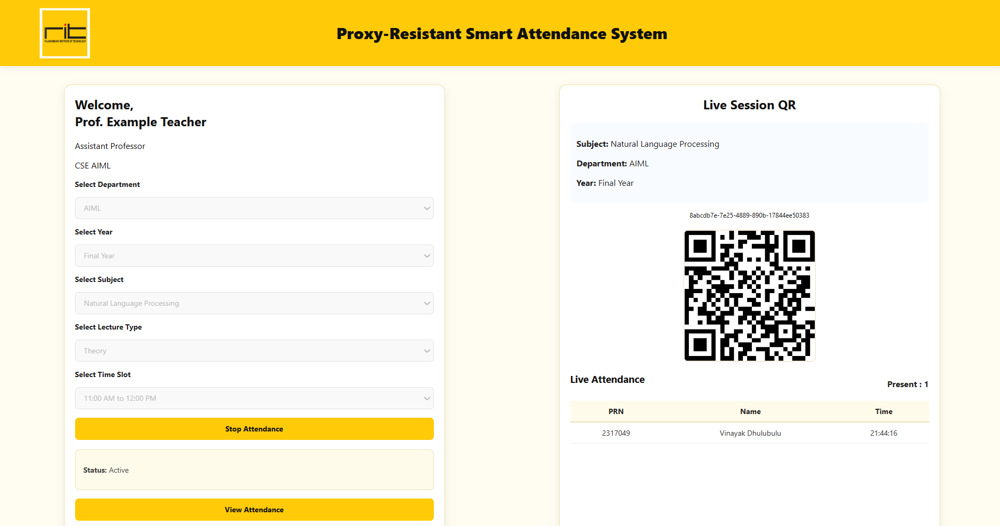

---

### **Teacher Attendance Dashboard**

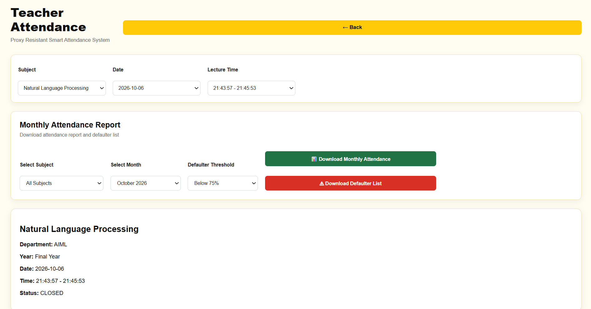

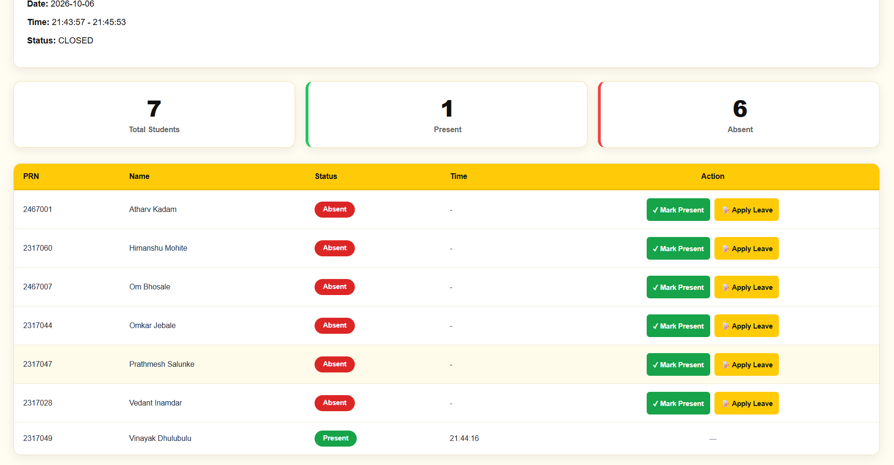

---

### **Apply Leave**

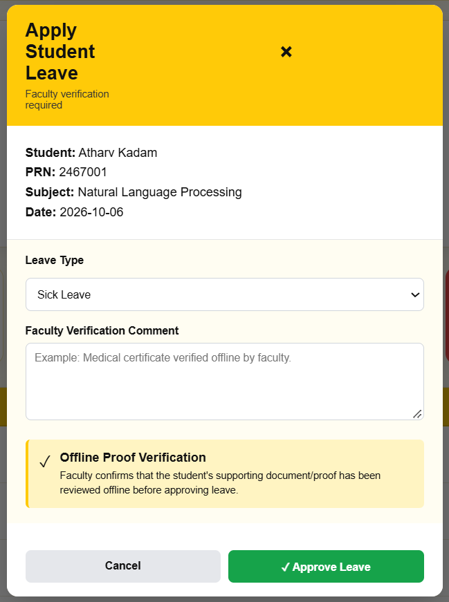

---

### **Monthly Attendace List**

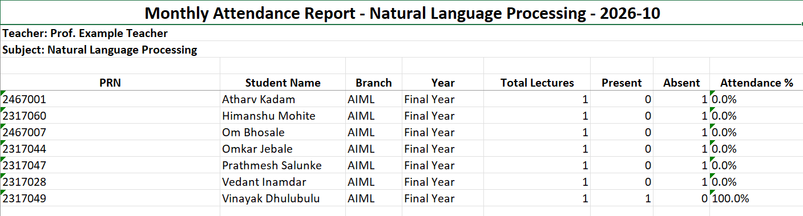

---

### **Defaulter List**

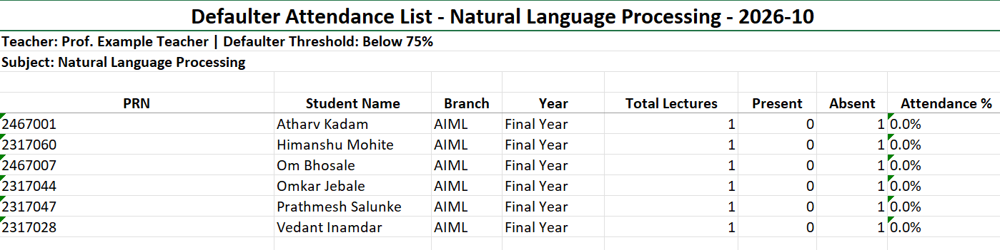

---

### **Student Dashboard**

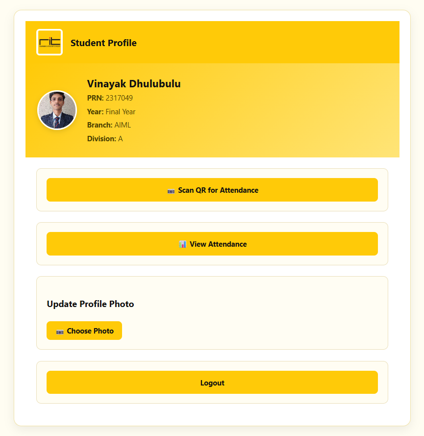

---

### **Student Attendance Dashboard**

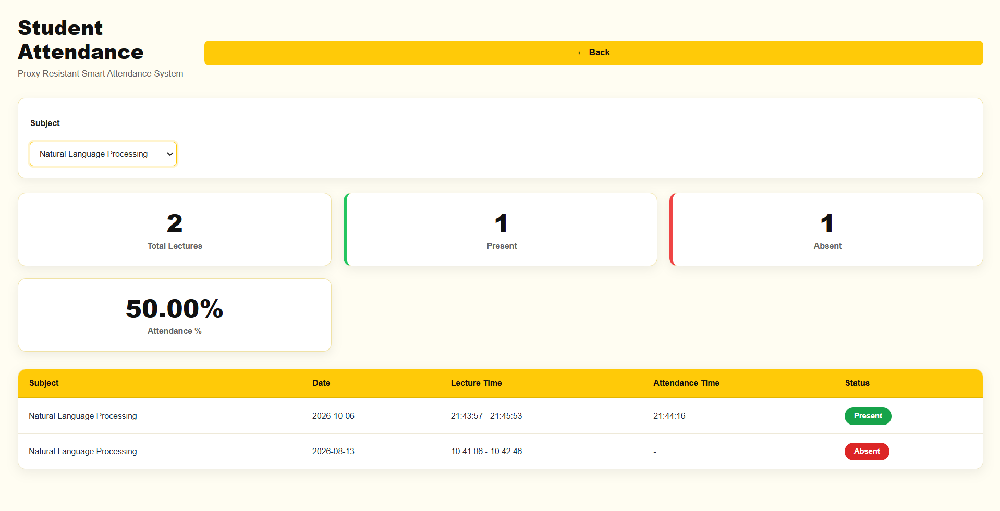

---

### **Scanner**

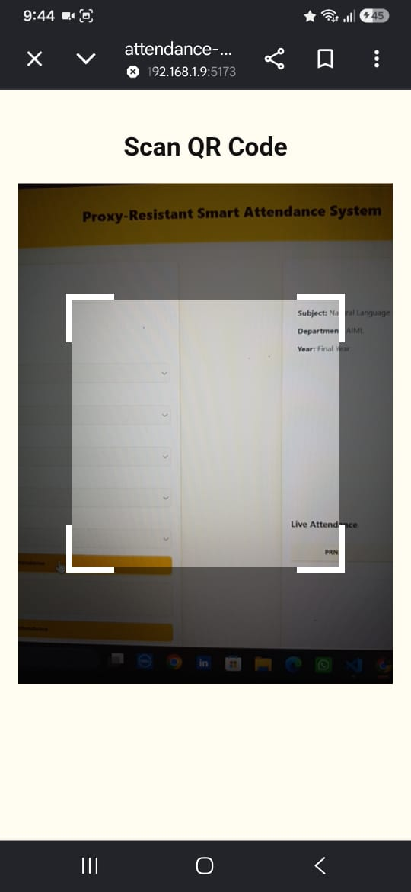

---

### **Selfie Camera**

---

### **Admin Dashboard**

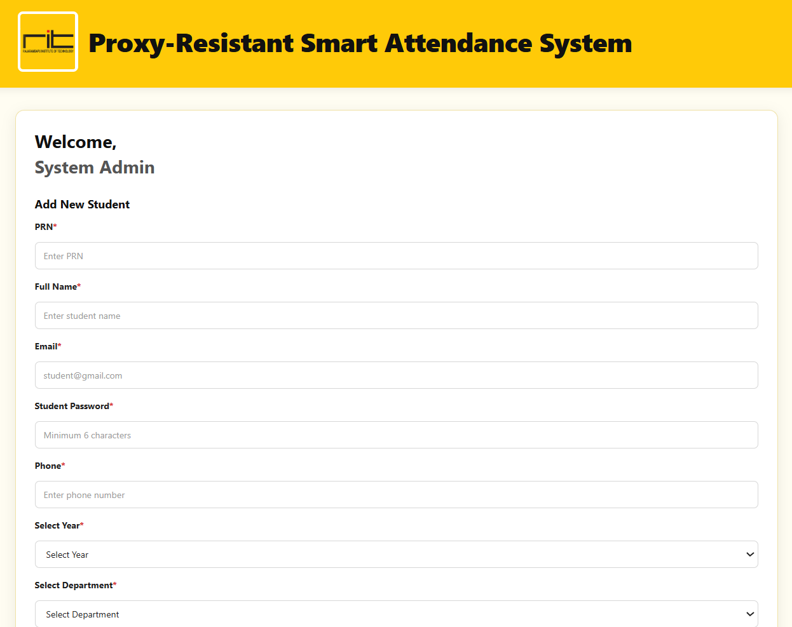

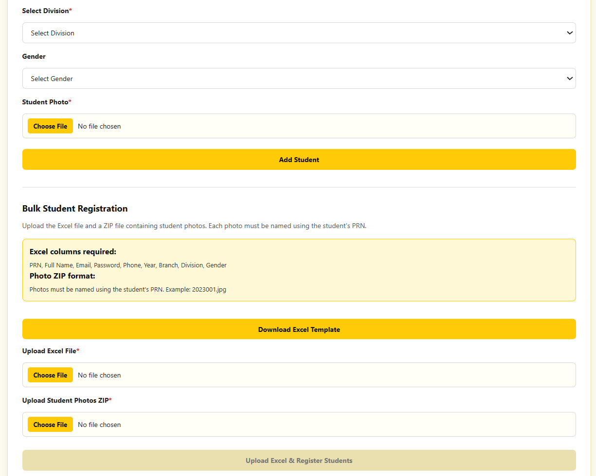

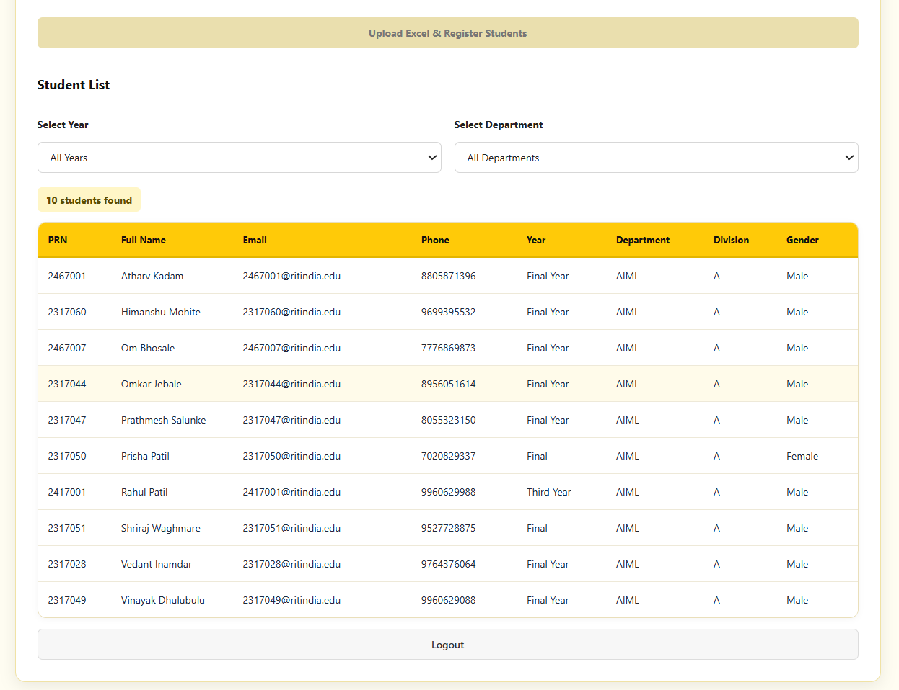

---

## **Modules**

- **User Authentication**: Secure login, role-based access control  
- **Dynamic QR Generation**: Time-limited, session-based QR codes  
- **QR Scanning**: Mobile browser-based scanning and session validation  
- **Live Camera Verification**: AI facial recognition with liveness detection  
- **GPS Validation**: Geo-fencing for physical presence verification  
- **Attendance Management**: Secure, tamper-proof attendance recording  
- **Admin Dashboard**: Real-time analytics, reports, and academic audits  

---

## **Technology Stack**

| Component        | Technology/Framework                 |
|-----------------|-------------------------------------|
| Frontend        | React.js / HTML / CSS / JavaScript   |
| Backend         | Node.js / Django / Flask             |
| Database        | MySQL / MongoDB                      |
| AI/ML Framework | TensorFlow / OpenCV                  |
| Browser Features| Camera & GPS support                 |

---

## **System Requirements**

**Software:**  
- Modern web browser with **camera & GPS support**  
- **Node.js / Django / Flask** server environment  

**Hardware:**  
- **Laptop/PC**: Minimum 8GB RAM, Intel i5/Ryzen 5, 256GB SSD  
- **Smartphone**: Android/iOS device with 8MP+ camera & GPS  
- **Internet**: Stable broadband connection (10 Mbps+)  

---

## **Expected Outcomes**

- **Secure and proxy-resistant attendance system**  
- **Real-time, accurate digital attendance records**  
- **Reduced administrative workload for faculty**  
- **Potential for publication** in IEEE/Scopus journals and participation in National Hackathons  
- **Cost-effective and scalable solution** for educational institutions
